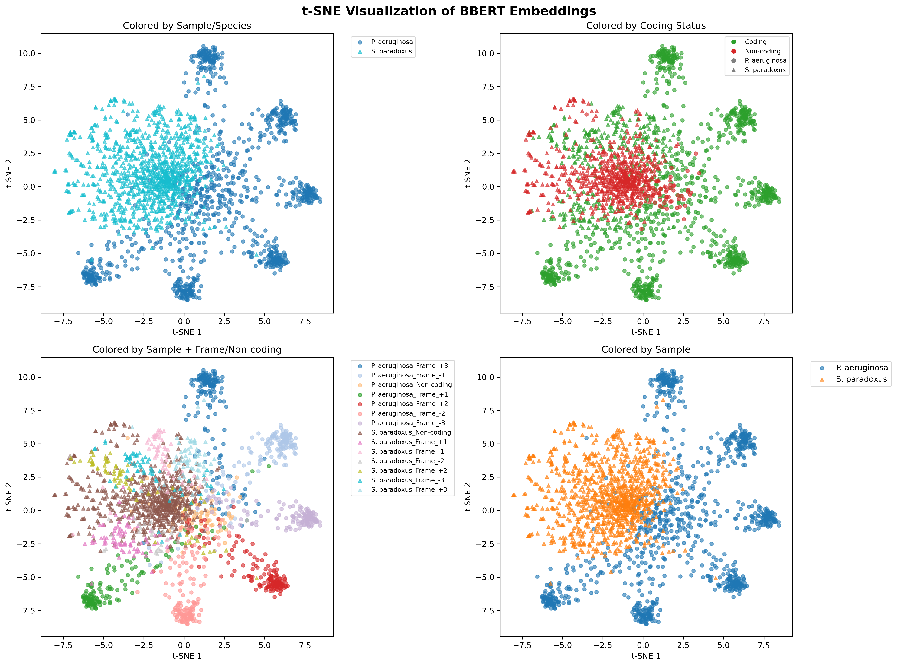



# BBERT: BERT for Bacterial DNA Classification

BBERT is a BERT-based transformer model fine-tuned for DNA sequence analysis, specifically designed for bacterial sequence classification and genomic feature prediction. The model performs three key classification tasks:

- **Bacterial Classification**: Distinguishes bacterial DNA from non-bacterial sequences
- **Reading Frame Prediction**: Identifies the correct reading frame (1 of 6 possible frames)
- **Coding Sequence Classification**: Determines whether sequences are protein-coding or non-coding

The model processes short DNA sequences (100bp or longer) and outputs classification probabilities along with sequence embeddings for downstream analysis.

See our manuscript
[Fast and accurate taxonomic domain assignment of short metagenomic reads using BBERT, D Alekhin, M Alon, T Sidi, S Perez, G Carmi, OM Finkel, A Erez
doi: https://doi.org/10.1101/2025.09.07.674730](https://www.biorxiv.org/content/10.1101/2025.09.07.674730v1)

## Quick Start (New in v0.2.0!)

```bash
# Install from source (pip package coming soon to PyPI)
git clone https://github.com/AmirErez/BBERT.git
cd BBERT
pip install -e .

# Download models from HuggingFace
bbert download

# Run inference
bbert infer examples/data/example.fasta --output-dir results

# Get help
bbert --help
```

## Table of Contents

- [Quick Start](#quick-start-new-in-v020)
- [System Requirements](#system-requirements)
- [1. Installation](#1-installation)
  - [1.1. Quick Install (Recommended)](#11-quick-install-recommended)
  - [1.2. Download from Source](#12-download-from-source)
    - [Option 1: From GitHub](#option-1-from-github)
    - [Installing Git Large File Storage](#installing-git-large-file-storage)
    - [Option 2: From Zenodo](#option-2-from-zenodo)
  - [1.3. Install using Conda](#13-install-using-conda)
    - [For Linux with CUDA](#for-linux-with-cuda)
    - [For Mac](#for-mac)
    - [For Windows](#for-windows)
    - [Manual installation for Mac/CPU-only systems](#manual-installation-for-maccpu-only-systems)
  - [1.3. Verify Installation](#13-verify-installation)
    - [Step 1: Run System Diagnostics](#step-1-run-system-diagnostics-required)
    - [Step 2: Run Accuracy Tests](#step-2-run-accuracy-tests-recommended)
    - [Step 3: Test with Example Data](#step-3-test-with-example-data)
- [2. Running BBERT](#2-running-bbert)
  - [2.1. Using the Convenient Executables](#21-using-the-convenient-executables-recommended)
    - [System Diagnostics](#system-diagnostics)
    - [Usage Examples](#usage-examples)
  - [2.2. Direct Script Usage](#22-direct-script-usage)
    - [Features](#features)
    - [Usage](#usage)
    - [Arguments](#arguments)
- [3. Output Format](#3-output-format)
  - [Reading Results](#reading-results)
- [4. Post-Processing BBERT Outputs](#4-post-processing-bbert-outputs)
  - [Single-End Data Processing](#single-end-data-processing)
  - [Paired-End Data Processing](#paired-end-data-processing)
  - [Final Output Format](#final-output-format)
  - [Extracting Coding Amino Acid Sequences](#extracting-coding-amino-acid-sequences)
- [5. Visualizing BBERT Embeddings](#5-visualizing-bbert-embeddings)
  - [Prerequisites](#prerequisites)
  - [Creating t-SNE Visualizations](#creating-t-sne-visualizations)
  - [Usage Requirements](#usage-requirements)
  - [What the Visualization Shows](#what-the-visualization-shows)
  - [Interpreting Results](#interpreting-results)
- [6. Genomic Accuracy Analysis](#6-genomic-accuracy-analysis)
  - [Usage](#usage-1)
  - [What This Analysis Does](#what-this-analysis-does)
  - [Key Parameters](#key-parameters)
  - [Advanced Features](#advanced-features)
  - [Sample Output](#sample-output)
- [7. Troubleshooting](#7-troubleshooting)
  - [Installing Git](#installing-git)
  - [Downloading Without Git](#downloading-without-git-alternative-methods)
  - [Common Installation Issues](#common-installation-issues)
  - [Getting Help](#getting-help)

## System Requirements

- **Python**: 3.10+
- **GPU**: 
  - CUDA-compatible GPU recommended (tested with CUDA 12.4)
  - Apple Silicon Macs: MPS acceleration supported
  - CPU-only: Supported but slower
- **Memory**: Minimum 8GB RAM, 4GB+ GPU memory recommended  
- **Storage**: ~2GB for model files (automatically downloaded from Hugging Face Hub)
- **Dependencies**: PyTorch, Transformers, PyArrow, pandas, scikit-learn, seaborn, huggingface_hub

## 1. Installation

### 1.1. Quick Install (Recommended)

**New in v0.2.0**: BBERT is now pip-installable!

```bash
# Clone the repository
git clone https://github.com/AmirErez/BBERT.git
cd BBERT

# Install with pip (creates 'bbert' command)
pip install -e .

# Download models from HuggingFace
bbert download
```

**That's it!** You can now use `bbert infer`, `bbert download`, etc.

**Requirements:**
- Python 3.10 or higher
- pip (included with Python)
- No conda required (but can be used if preferred)

**What gets installed:**
- `bbert` command-line tool
- All Python dependencies (PyTorch, Transformers, etc.)
- Package available for import: `from bbert import BertClassifier`

### 1.2. Download from Source

**Clone the repository:**
```bash
git clone https://github.com/AmirErez/BBERT.git
cd BBERT
```

**Note about model files:**
- Models are automatically downloaded from [Hugging Face Hub](https://huggingface.co/AmirErez/BBERT-models) on first run
- No Git LFS setup required!
- To manually download models: `bbert download` or `bbert download`

<details>
<summary><b>Optional: Using Git LFS (legacy method)</b></summary>

If you prefer to use Git LFS instead of Hugging Face downloads:

**On Unix/Linux:**
```bash
sudo apt-get install git-lfs  # Ubuntu/Debian
# OR
sudo yum install git-lfs      # CentOS/RHEL/Fedora
```

**On Mac:**
```bash
# Using Homebrew
brew install git-lfs
# OR MacPorts
sudo port install git-lfs
```

**Initialize Git LFS:**
```bash
git lfs install
git lfs pull
```

**Note:** Git LFS has bandwidth limits on GitHub. Hugging Face provides unlimited bandwidth.
</details>

### 1.2. Install using Conda

**Prerequisites:** You need conda or mamba installed on your system:
- **Conda:** Download from https://conda.io/miniconda.html or https://www.anaconda.com/
- **Mamba:** Faster alternative, install with `conda install mamba -n base -c conda-forge`
All conda commands can be interchanged to mamba commands depending on your install.

#### For Linux with CUDA:
```bash
conda env create -f BBERT_env.yml  
```

#### For Mac:
```bash
conda env create -f BBERT_env_mac.yml
conda activate BBERT_mac
```

#### For Windows 
Note that the windows version is the least well supported, we include it here for user convenience.
BBERT is meant to run on linux machines and mac is close enough for the compatibility to be easy.
In Windows, path separators have '\' instead of '/', and so will all need manual fixing to work.

##### Windows with NVIDIA GPU:
```bash
conda env create -f BBERT_env_windows.yml
conda activate BBERT_windows
```

##### Windows CPU-only:
```bash
conda env create -f BBERT_env_windows_cpu.yml
conda activate BBERT_windows_cpu
```

#### Manual installation for Mac/CPU-only systems:
```bash
conda create -n BBERT python=3.10  
conda activate BBERT  

# Core PyTorch (Mac with Apple Silicon gets MPS acceleration automatically)
conda install pytorch torchvision torchaudio -c pytorch

# Core dependencies
conda install -c conda-forge transformers=4.30.2 pyarrow pandas scikit-learn seaborn tqdm pyyaml
conda install biopython psutil
conda install "numpy<2"  # Fix compatibility issues

# Additional packages
pip install datasets huggingface_hub safetensors tokenizers torchinfo pynvml
```
### 1.4. Verify Installation

#### Step 1: Check Installation
Verify that BBERT is installed correctly:

```bash
# Check version
bbert --version
# Should show: BBERT 0.2.0

# Check command is available
bbert --help
```

#### Step 2: Download Models
Download the required model files from HuggingFace:

```bash
bbert download
```

This will verify:
- ✅ Internet connection to HuggingFace Hub
- ✅ Model files downloaded (~2GB)
- ✅ Files placed in correct directories

#### Step 3: Run Accuracy Tests (Recommended)
Validate BBERT's classification accuracy:

```bash
python scripts/testing/test_inference_accuracy.py
```

This test uses known ground truth sequences:
- Sequences 1-5: *E. coli* K-12 (should classify as bacterial, bact_prob > 0.5)
- Sequences 6-10: *Saccharomyces cerevisiae* (should classify as non-bacterial, bact_prob < 0.5)

**Expected results:**
```
Ran 10 tests in 1.7s
OK
```
Perfect classification: All 10 sequences correctly classified!

#### Step 4: Test with Example Data
Try processing example data:

```bash
bbert infer examples/data/example.fasta --output-dir examples/data/ --batch-size 64
```

The output will be in `examples/data/example_scores_len.parquet`. View results:
```python
import pandas as pd
df = pd.read_parquet('examples/data/example_scores_len.parquet')
print(df.head())
```


## 2. Running BBERT

### 2.1. Using the CLI (Recommended - New in v0.2.0!)

The `bbert` command provides a clean interface for all operations:

#### Basic Inference

```bash
# Single file
bbert infer sequences.fasta --output-dir results

# Multiple files
bbert infer file1.fasta file2.fastq.gz --output-dir results

# With options
bbert infer data.fasta --output-dir results --batch-size 512 --max-reads 10000

# Include embeddings (warning: large files, use --max-reads)
bbert infer data.fasta --output-dir results --emb-out --max-reads 1000
```

#### CLI Arguments

```
bbert infer [files...] --output-dir DIR [options]

Required:
  files                 Input FASTA/FASTQ files (supports .gz)
  --output-dir DIR      Output directory for results

Optional:
  --batch-size N        Batch size (default: 1024)
  --max-reads N         Limit number of reads per file
  --emb-out             Include embeddings in output
  --hidden-size SIZE    Model size: 384 or 768 (default: 768)
```

#### Download Models

```bash
# Download all models from HuggingFace
bbert download

# Force re-download
bbert download --force

# Download to specific directory
bbert download --output-dir /path/to/models
```

#### Get Help

```bash
# General help
bbert --help

# Command-specific help
bbert infer --help
bbert download --help

# Check version
bbert --version
```

## 3. Output Format

The inference script outputs results to a Parquet file containing:

| Column | Description |
|--------|-------------|
| `id` | Sequence identifier |
| `len` | Sequence length |
| `loss` | Cross-entropy loss value |
| `bact_prob` | Bacterial classification probability (0-1) |
| `frame_prob` | Reading frame probabilities (array of 6 values: positions 0-5 correspond to frames -1,-3,-2,+1,+3,+2) |
| `coding_prob` | Coding sequence probability (0-1) |

### Reading Results
In the python console, 

```python
import pandas as pd
df = pd.read_parquet('examples/data/example_scores_len.parquet')
print(df.head())

# Get sequences predicted as bacterial (>50% probability)
bacterial_seqs = df[df['bact_prob'] > 0.5]

# Get most likely reading frame for each sequence
import numpy as np
# Frame mapping: positions 0-5 correspond to frames [-1, -3, -2, +1, +3, +2]
frame_mapping = [-1, -3, -2, +1, +3, +2]
df['predicted_frame'] = df['frame_prob'].apply(lambda x: frame_mapping[np.argmax(x)])
print(df.head())
```

## 4. Post-Processing BBERT Outputs

BBERT inference produces Parquet files with classification scores. Depending on your data type, use the appropriate post-processing script to convert to a consistent TSV format.

### Single-End Data Processing

For single-end sequencing data, convert Parquet to TSV format:

```bash
# First generate the parquet file if needed
bbert infer examples/data/example.fasta --output-dir results

# Then convert to TSV
python examples/utilities/convert_scores_to_tsv.py \
    --input results/example_scores_len.parquet \
    --output_dir results \
    --output_prefix example
```
> **Windows**: `python examples/utilities/convert_scores_to_tsv.py --input results/example_scores_len.parquet --output_dir results --output_prefix example`

**Output:**
- `example_good_long_scores.tsv.gz` - Reads ≥100bp with scores
- `example_good_short_scores.tsv.gz` - Reads <100bp (excluded from analysis)

### Paired-End Data Processing

For paired-end sequencing data (R1/R2 files), first generate scores, then merge them:

```bash
# Step 1: Generate scores for both R1 and R2 files
bbert infer \
    examples/data/Pseudomonas_aeruginosa_R1.fasta.gz \
    examples/data/Pseudomonas_aeruginosa_R2.fasta.gz \
    --output-dir results

# Step 2: Merge the paired-end scores
python examples/utilities/merge_paired_scores.py \
    --r1 results/Pseudomonas_aeruginosa_R1_scores_len.parquet \
    --r2 results/Pseudomonas_aeruginosa_R2_scores_len.parquet \
    --output_dir results \
    --output_prefix Pseudomonas_aeruginosa
```

> **Windows**: Same commands work on Windows

**Output:**
- `Pseudomonas_aeruginosa_good_long_scores.tsv.gz` - Combined scores for read pairs ≥100bp
- `Pseudomonas_aeruginosa_good_short_scores.tsv.gz` - Filtered short read pairs
- `Saccharomyces_paradoxus_good_long_scores.tsv.gz` - Combined scores for read pairs ≥100bp  
- `Saccharomyces_paradoxus_good_short_scores.tsv.gz` - Filtered short read pairs

**Score combination logic:**
- Both R1,R2 ≥100bp: Average their `loss` and `bact_prob`
- Only one read ≥100bp: Use that read's scores  
- Both reads <100bp: Exclude from long scores file

### Final Output Format

Both post-processing scripts produce consistent TSV.GZ files:

**Long scores file** (`*_good_long_scores.tsv.gz`):
| Column | Description |
|--------|-------------|
| `id` | Sequence identifier |
| `loss` | Cross-entropy loss value |
| `bact_prob` | Bacterial classification probability (0-1) |

**Short scores file** (`*_good_short_scores.tsv.gz`):
Contains metadata for reads/pairs excluded due to length filtering.


### Extracting Coding Amino Acid Sequences

To extract amino acid sequences from reads predicted as coding sequences, use the coding amino acid extraction script. This script separates bacterial and non-bacterial coding sequences into two output files:

```bash
# Step 1: Generate BBERT scores (if not already done)
bbert infer examples/data/example.fasta --output-dir results

# Step 2: Extract coding sequences as amino acids (basic usage)
python examples/utilities/extract_coding_AA.py \
    --input examples/data/example.fasta \
    --parquet results/example_scores_len.parquet \
    --out_bact bacterial_proteins.fasta \
    --out_nonbact nonbacterial_proteins.fasta

# Example with custom probability thresholds:
# Step 1: Generate scores for Pseudomonas reads
bbert infer examples/data/Pseudomonas_aeruginosa_R1.fasta.gz --output-dir results

# Step 2: Extract coding sequences with custom thresholds
python examples/utilities/extract_coding_AA.py \
    --input examples/data/Pseudomonas_aeruginosa_R1.fasta.gz \
    --parquet results/Pseudomonas_aeruginosa_R1_scores_len.parquet \
    --out_bact pseudomonas_bacterial_proteins.fasta \
    --out_nonbact pseudomonas_nonbacterial_proteins.fasta \
    --bacterial_threshold 0.8 \
    --coding_threshold 0.7
```

> **Windows**:
> ```cmd
> bbert infer examples/data/example.fasta --output-dir results
> python examples/utilities/extract_coding_AA.py --input examples/data/example.fasta --parquet results/example_scores_len.parquet --out_bact bacterial_proteins.fasta --out_nonbact nonbacterial_proteins.fasta
> bbert infer examples/data/Pseudomonas_aeruginosa_R1.fasta.gz --output-dir results
> python examples/utilities/extract_coding_AA.py --input examples/data/Pseudomonas_aeruginosa_R1.fasta.gz --parquet results/Pseudomonas_aeruginosa_R1_scores_len.parquet --out_bact pseudomonas_bacterial_proteins.fasta --out_nonbact pseudomonas_nonbacterial_proteins.fasta --bacterial_threshold 0.8 --coding_threshold 0.7
> ```

**What this script does:**
- Reads BBERT classification results and original sequence files
- Filters for sequences with high coding probability
- Separates coding sequences into bacterial and non-bacterial based on bacterial probability
- Determines the most likely reading frame using BBERT's frame predictions
- Translates DNA sequences to amino acids using BioPython
- Outputs protein sequences in two separate FASTA files with prediction metadata

**Arguments:**
- `--input`: Original sequence file (FASTA/FASTQ, compressed or uncompressed)  
- `--parquet`: BBERT parquet results file
- `--out_bact`: Output amino acid FASTA file for bacterial coding sequences
- `--out_nonbact`: Output amino acid FASTA file for non-bacterial coding sequences
- `--bacterial_threshold`: Minimum bacterial probability (default: 0.5)
- `--coding_threshold`: Minimum coding probability (default: 0.5)

**Output FASTA headers include:**
```
>sequence_id | bact_prob=0.952 | coding_prob=0.971
```

This approach allows post-processing extraction without modifying the main inference pipeline or increasing memory usage.


## 5. Visualizing BBERT Embeddings

BBERT can output high-dimensional embeddings that capture sequence features learned by the transformer model. These embeddings can be visualized using t-SNE to explore how BBERT groups sequences by organism type, coding status, and reading frame.

### Prerequisites

The visualization requires embeddings to be generated during inference using the `--emb_out` flag:

```bash
# Generate embeddings for visualization (if not done already)
bbert infer \
    examples/data/Pseudomonas_aeruginosa_R1.fasta.gz \
    examples/data/Pseudomonas_aeruginosa_R2.fasta.gz \
    examples/data/Saccharomyces_paradoxus_R1.fasta.gz \
    examples/data/Saccharomyces_paradoxus_R2.fasta.gz \
    --output-dir example --emb-out --max-reads 1000 --batch-size 512
```

**⚠️ Important**:
- Embedding files (`*_scores_len_emb.parquet`) are much larger than regular output files and processing is slower
- `--emb_out` requires `--max_reads` to prevent accidentally creating huge files

### Creating t-SNE Visualizations

Once embeddings are generated, create interactive visualizations:

```bash
# Check that embedding files exist
ls example/*_scores_len_emb.parquet

# If no embedding files found, you'll see:
# ls: example/*_scores_len_emb.parquet: No such file or directory
# Run the --emb_out command above first!

# Basic usage with required parameters
python examples/visualization/visualize_embeddings.py \
  --files "example/Pseudomonas_aeruginosa_R1_scores_len_emb.parquet,example/Saccharomyces_paradoxus_R1_scores_len_emb.parquet" \
  --labels "P. aeruginosa,S. paradoxus" \
  --output_dir example \
  --output_name bacterial_vs_eukaryotic \
  --max_reads 500

# Use PCA (faster alternative to t-SNE)
python examples/visualization/visualize_embeddings.py \
  --files "example/Pseudomonas_aeruginosa_R1_scores_len_emb.parquet,example/Saccharomyces_paradoxus_R1_scores_len_emb.parquet" \
  --labels "P. aeruginosa,S. paradoxus" \
  --output_dir example \
  --output_name bacterial_vs_eukaryotic_pca \
  --method pca \
  --max_reads 500
```

> **Windows**:
> ```cmd
> python examples/visualization/visualize_embeddings.py --files "example/Pseudomonas_aeruginosa_R1_scores_len_emb.parquet,example/Saccharomyces_paradoxus_R1_scores_len_emb.parquet" --labels "P. aeruginosa,S. paradoxus" --output_dir example --output_name bacterial_vs_eukaryotic --max_reads 500
> python examples/visualization/visualize_embeddings.py --files "example/Pseudomonas_aeruginosa_R1_scores_len_emb.parquet,example/Saccharomyces_paradoxus_R1_scores_len_emb.parquet" --labels "P. aeruginosa,S. paradoxus" --output_dir example --output_name bacterial_vs_eukaryotic_pca --method pca --max_reads 500
> ```

The t-SNE output will be in example/bacterial_vs_eukaryotic.png and .pdf, and looks like this:


### Usage Requirements

The visualization script now requires explicit parameters for all inputs:

**Required parameters:**
- `--files`: Comma-separated list of embedding parquet files
- `--labels`: Comma-separated list of labels for each file (must match number of files)
- `--output_dir`: Directory to save visualization files
- `--output_name`: Output filename (without extension)

**Optional parameters:**
- `--method`: Choose between `tsne` or `pca` (default: tsne)
- `--max_reads`: Maximum reads per category (default: 1000)
- `--perplexity`: Perplexity parameter for fine-tuning t-SNE behavior


### What the Visualization Shows

The script creates 4-panel plots saved in both PNG and PDF formats that reveal:

1. **Sample/Species Separation**: How well BBERT separates different samples using your provided labels
2. **Coding Classification**: Distinction between protein-coding and non-coding DNA sequences based on BBERT predictions
3. **Reading Frame Grouping**: Clustering of sequences by BBERT's predicted reading frames (positions 0-5 map to frames -1,-3,-2,+1,+3,+2)
4. **Sample Distribution**: Comparison between different samples (e.g., R1/R2 reads, different conditions)

### Interpreting Results

**Expected patterns:**
- **Clear organism separation**: Pseudomonas and Saccharomyces should form distinct clusters
- **Coding vs. non-coding**: Protein-coding sequences often cluster separately from non-coding regions
- **Frame consistency**: Sequences in the same reading frame may group together
- **R1/R2 similarity**: Paired-end reads from the same organism should cluster near each other

**Visualization Options:**
- `--method`: Choose `tsne` or `pca` (default: `tsne`)
- `--output_name`: Custom output filename (generates both `.png` and `.pdf`)
- `--max_reads`: Limit reads per category for faster processing
- `--perplexity` and `--n_iter`: Fine-tune t-SNE parameters

**Troubleshooting visualization:**

If embeddings are missing:
```bash
# Error: No embedding parquet files found in example
# Solution: Re-run BBERT with --emb-out and --max-reads flags
bbert infer examples/data/*.fasta.gz --output-dir example --emb-out --max-reads 1000
```

## 6. Genomic Accuracy Analysis

For comprehensive evaluation of BBERT's performance on real genomic data, use the genomic accuracy analysis script. This tool generates synthetic reads from annotated genomes and evaluates BBERT's classification accuracy across multiple tasks.

### Usage

```bash
mkdir -p tests
# Analyze bacterial genome (P.aeruginosa example)
python scripts/testing/test_genomic_accuracy.py \
    --fasta examples/data/GCF_000016525_P_aeruginosa.fasta.gz \
    --gtf examples/data/GCF_000016525_P_aeruginosa.gtf.gz \
    --is_bact true \
    --taxon "P.aeruginosa" \
    --reads_per_cds 1 \
    --output_dir tests \
    --verbose

# Analyze eukaryotic genome (S.cerevisiae example)
python scripts/testing/test_genomic_accuracy.py \
    --fasta examples/data/GCF_000146045_S_cerevisiae.fasta.gz \
    --gtf examples/data/GCF_000146045_S_cerevisiae.gtf.gz \
    --is_bact false \
    --taxon "S.cerevisiae" \
    --output_dir tests \
    --reads_per_cds 1

# Analyze archaeal genome (M.smithii example)
python scripts/testing/test_genomic_accuracy.py \
    --fasta examples/data/GCF_000016525_M_smithii.fasta.gz \
    --gtf examples/data/GCF_000016525_M_smithii.gtf.gz \
    --is_bact true \
    --taxon "M.smithii" \
    --output_dir tests \
    --reads_per_cds 2
```

> **Windows**:
> ```cmd
> mkdir tests
> python scripts/testing/test_genomic_accuracy.py --fasta examples/data/GCF_000016525_P_aeruginosa.fasta.gz --gtf examples/data/GCF_000016525_P_aeruginosa.gtf.gz --is_bact true --taxon "P.aeruginosa" --reads_per_cds 1 --output_dir tests --verbose
> python scripts/testing/test_genomic_accuracy.py --fasta examples/data/GCF_000146045_S_cerevisiae.fasta.gz --gtf examples/data/GCF_000146045_S_cerevisiae.gtf.gz --is_bact false --taxon "S.cerevisiae" --output_dir tests --reads_per_cds 1
> python scripts/testing/test_genomic_accuracy.py --fasta examples/data/GCF_000016525_M_smithii.fasta.gz --gtf examples/data/GCF_000016525_M_smithii.gtf.gz --is_bact true --taxon "M.smithii" --output_dir tests --reads_per_cds 2
> ```

### What This Analysis Does

The genomic accuracy analysis performs comprehensive evaluation by:

- **Generating coding reads** from CDS regions with correct biological frame labels
- **Generating non-coding reads** proportional to genome composition (intergenic regions)
- **Running BBERT inference** on all generated reads
- **Reporting detailed accuracy metrics** for:
  - Coding vs non-coding sequence classification
  - Reading frame prediction (6-frame accuracy) 
  - Bacterial vs non-bacterial classification with bias correction

### Key Parameters

- `--reads_per_cds`: Number of reads per CDS
  - If ≥ 6: Distributed evenly across all 6 reading frames
  - If < 6: Randomly selects frames (e.g., `--reads_per_cds 1` generates 1 read per CDS from a random frame)
- `--noncoding_reads -1`: Auto-calculate non-coding reads proportional to genome composition
- `--noncoding_reads N`: Override with specific number of non-coding reads
- `--verbose`: Show detailed BBERT inference progress

### Sample Output

Example output from running the M.smithii archaeal genome test:

```
================================================================================
BBERT GENOMIC TEST RESULTS - M.smithii
================================================================================
Total test reads: 3868
  Coding reads: 3553
  Non-coding reads: 315

SEQUENCE TYPE CLASSIFICATION:
  Coding prediction:     3225/3553 (90.8%)
  Non-coding prediction: 290/315 (92.1%)
  Overall coding/non-coding: 3515/3868 (90.9%)

READING FRAME PREDICTION (coding sequences only):
  Frame accuracy: 3438/3553 (96.8%)

BACTERIAL CLASSIFICATION:
  Bacterial prediction (overall): 3324/3868 (85.9%)
    Coding sequences:     3281/3553 (92.3%)
    Non-coding sequences: 43/315 (13.7%)

PROBABILITY DISTRIBUTIONS:
  Mean bacterial probability (all): 0.811
  Mean bacterial probability (coding seqs): 0.859
  Mean bacterial probability (non-coding seqs): 0.270
  Mean coding probability (all): 0.777
  Mean coding probability (coding seqs): 0.832
  Mean coding probability (non-coding seqs): 0.155
```


## 7. Troubleshooting

### Installing Git

If you don't have Git installed on your system, you'll need it to clone the repository. Model files are automatically downloaded from Hugging Face Hub.

**On Unix/Linux:**
```bash
# Ubuntu/Debian
sudo apt-get update
sudo apt-get install git

# CentOS/RHEL/Fedora
sudo yum install git
# OR on newer versions
sudo dnf install git

# Arch Linux
sudo pacman -S git
```

**On Mac:**
```bash
# Using Homebrew (recommended)
brew install git

# Using MacPorts
sudo port install git

# Or download from: https://git-scm.com/download/mac
```

**On Windows:**
- Download Git for Windows from: https://git-scm.com/download/win
- Or use Windows Subsystem for Linux (WSL) and follow Linux instructions

### Downloading Without Git (Alternative Methods)

If you cannot install Git, here are alternative approaches:

#### Option 1: Manual File Download
**⚠️ Warning:** This is tedious and not recommended for large repositories.

1. **Download repository code:** Use GitHub's "Download ZIP" button
2. **Manually download model files:** 
   - Navigate to each model file in the GitHub web interface
   - Click on the file, then "View raw" 
   - Right-click "View raw" and "Save link as..."
   - Repeat for all model files in these directories:
     - `models/diverse_bact_12_768_6_20000/`
     - `models/classifiers/bacterial/models/`
     - `models/classifiers/frame/models/`
     - `models/classifiers/coding/models/`

#### Option 2: Use Git GUI Clients
Some GUI clients for Git (note: model files download automatically from Hugging Face, no Git LFS needed):
- **GitHub Desktop:** https://desktop.github.com/
- **Sourcetree:** https://www.sourcetreeapp.com/
- **GitKraken:** https://www.gitkraken.com/

### Common Installation Issues

#### Issue: "git: command not found"
**Solution:** Install Git using the instructions above.

#### Issue: "git-lfs: command not found"
**Solution:** Git LFS is optional. Models are automatically downloaded from Hugging Face Hub. If you still want to use Git LFS, see the legacy instructions in Section 1.1.

#### Issue: "tokenizers version conflict" (transformers ImportError)
**Solution:** Install the correct tokenizers version:
```bash
conda activate BBERT_mac  # or your environment name
pip install tokenizers==0.13.3
```

#### Issue: "CUDA not available" on systems with GPU
**Solutions:**
- Verify CUDA installation: `nvidia-smi`
- Reinstall PyTorch with CUDA support
- For Mac: The model will automatically use MPS (Metal Performance Shaders)

#### Issue: Windows environment creation fails with Linux-specific packages
**Problem:** `BBERT_env.yml` contains Linux-specific packages that aren't available on Windows.
**Solution:** Use the Windows-specific environment file:
```bash
conda env create -f BBERT_env_windows.yml
conda activate BBERT_windows
```

#### Issue: "Out of memory" errors
**Solutions:**
- Reduce batch size: `--batch_size 32` or lower
- Close other applications to free memory
- For CPU-only systems, use smaller batch sizes (8-16)

#### Issue: Repository download as ZIP doesn't include model files
**Explanation:** Model files are downloaded separately from Hugging Face Hub.
**Solution:** Models will be automatically downloaded on first run. No manual action needed!

#### Issue: Model download fails
**Possible causes:**
- No internet connection
- Firewall blocking Hugging Face Hub
- Missing `huggingface_hub` package

**Solutions:**
1. Check internet connection
2. Install huggingface_hub: `pip install huggingface_hub`
3. Manually download: `bbert download`
4. Alternative: Use Git LFS method (see Section 1.1)

### Getting Help

If you encounter issues not covered here:

1. **Check existing issues:** https://github.com/AmirErez/BBERT/issues
2. **Create a new issue:** Include your:
   - Operating system and version
   - Python version
   - Complete error message
   - Command you were trying to run
3. **Provide system information:**
   ```bash
   python --version
   conda --version  # or mamba --version
   git --version
   bbert --version
   ```
